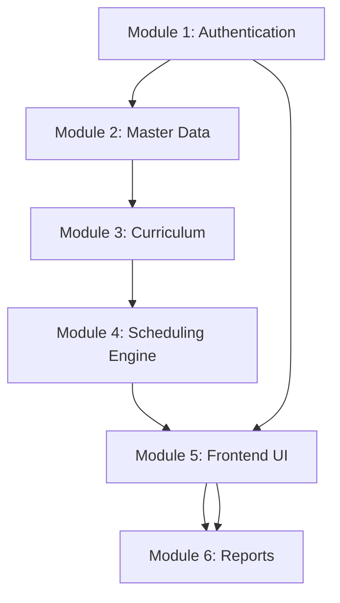

# 🎓 NEP 2020 Compliant AI-Based Timetable Generator

## 📋 Team Collaboration Guide for Beginners

> **Project Repository:** [Time-Table-Generator](https://github.com/Mithlesh-95/Time-Table-Generator)

This project addresses the complex scheduling challenges introduced by NEP 2020's flexible curriculum structure. Here's a comprehensive module breakdown for our **6-member team** working in parallel.

---

## 🏗️ Core System Architecture

### 📊 Module Division Overview



---

## 👥 Module Assignments

### 🔐 Module 1: User Management & Authentication System
**👤 Assigned to: Team Member 1**

#### 🎯 Components:
- **Admin Authentication & Authorization**
- **Role-based Access Control** (Super Admin, Department Admin, Faculty)
- **User Profile Management**
- **Session Management & Security**

#### ✨ Key Features:
- ✅ Secure login/logout functionality
- ✅ Password reset and user management
- ✅ Multi-level admin access (College → Department → Section)
- ✅ Activity logging and audit trails

---

### 📊 Module 2: Master Data Management System
**👤 Assigned to: Team Member 2**

#### 🎯 Components:

##### 👨‍🎓 Student Data Management
- Personal info, enrollment details, current semester
- Major/Minor subject selections
- Credit requirements tracking
- Elective preferences management

##### 👨‍🏫 Faculty Data Management
- Personal info, qualifications, experience
- Subject expertise mapping
- Workload capacity (weekly hours)
- Availability constraints (days/time slots)
- Teaching preferences

##### 🏢 Infrastructure Management
- Classroom capacity and type
- Laboratory specifications
- Equipment availability
- Room booking constraints

#### ✨ Key Features:
- ✅ CRUD operations for all master data
- ✅ Bulk upload via Excel/CSV
- ✅ Data validation and integrity checks
- ✅ Import/Export functionality

---

### 📚 Module 3: NEP 2020 Curriculum Management System
**👤 Assigned to: Team Member 3**

#### 🎯 Components:

##### 📖 Course Structure Management
- **Major subjects** (discipline-specific)
- **Minor subjects** (interdisciplinary)
- **Skill Enhancement Courses (SEC)**
- **Value Added Courses (VAC)**
- **Ability Enhancement Courses (AEC)**

##### 🎯 Credit System Management
- Theory/Practical credit allocation
- Total credit requirements per semester
- Flexible credit distribution
- Prerequisite course mapping

##### 🎓 Special Program Management
- Teaching Practice schedules
- Internship coordination
- Project work allocation
- Field work and community service

#### ✨ Key Features:
- ✅ NEP 2020 compliant course categorization
- ✅ Credit calculation and validation
- ✅ Flexible curriculum design support
- ✅ Multi-disciplinary course mapping

---

### 🤖 Module 4: Advanced Scheduling Algorithm Engine
**👤 Assigned to: Team Member 4**

#### 🎯 Components:

##### 🧠 Core Scheduling Algorithm
- **Constraint Satisfaction Problem (CSP)** solver
- **Genetic Algorithm** for optimization
- **Machine Learning** for pattern recognition
- **Multi-objective optimization**

##### ⚠️ Conflict Resolution System
- Faculty time clash detection
- Room double-booking prevention
- Student schedule conflict handling
- Resource allocation optimization

##### 🎯 Smart Scheduling Features
- Load balancing for faculty
- Gap minimization for students
- Preference-based allocation
- Emergency rescheduling capabilities

#### ✨ Key Features:
- ✅ AI-powered intelligent scheduling
- ✅ Real-time conflict detection and resolution
- ✅ Multiple scheduling strategies
- ✅ Performance optimization algorithms

---

### 🎨 Module 5: Frontend User Interface & Experience
**👤 Assigned to: Team Member 5**

#### 🎯 Components:

##### 📊 Admin Dashboard
- Data entry forms with validation
- Semester/branch/section selection interface
- Calendar-based working days selection
- Progress tracking and status updates

##### 📅 Timetable Visualization
- Interactive grid-based timetable display
- Color-coded subject categorization
- Responsive design for all devices
- Real-time preview during generation

##### 📋 Report Generation Interface
- Custom report builder
- Filter and search capabilities
- Export options selection
- Print-friendly layouts

#### ✨ Key Features:
- ✅ Modern, intuitive user interface
- ✅ Mobile-responsive design
- ✅ Real-time data validation
- ✅ Interactive timetable editing capabilities

---

### 📄 Module 6: Report Generation & Integration System
**👤 Assigned to: Team Member 6**

#### 🎯 Components:

##### 📑 PDF Generation Engine
- Student-specific timetables
- Faculty-specific schedules
- Department-wise consolidated views
- Custom report templates

##### 📤 Export & Integration System
- Excel export with formatting
- CSV data export
- API integration capabilities
- Email distribution system

##### 📈 Analytics & Reporting
- Faculty workload analysis
- Room utilization reports
- Student schedule analysis
- System performance metrics

#### ✨ Key Features:
- ✅ Multiple export formats (PDF, Excel, CSV)
- ✅ Professional timetable templates
- ✅ Automated report generation
- ✅ Integration with existing college systems

---

## 🔄 Inter-Module Dependencies & Communication

### 📊 Data Flow Architecture:
```
Module 2 (Master Data) ↔ Module 3 (Curriculum)
                ↓
Module 4 (Scheduling Algorithm)
                ↓
Module 5 (Frontend UI) ↔ Module 6 (Reports)
                ↑
Module 1 (Authentication)
```

### 🔗 API Integration Points:
- **Module 2 → Module 4:** Student/Faculty/Room data
- **Module 3 → Module 4:** Course structure and credit info
- **Module 4 → Module 5:** Generated timetable data
- **Module 5 → Module 6:** Report generation requests
- **Module 1 → All Modules:** Authentication and authorization

---

## ⏰ Development Timeline (48 Hours)

### 📅 Day 1 (First 24 Hours)
| Time | Task |
|------|------|
| **Hours 1-6** | Module setup and basic structure |
| **Hours 7-12** | Core functionality development |
| **Hours 13-18** | Inter-module API development |
| **Hours 19-24** | Basic integration testing |

### 📅 Day 2 (Second 24 Hours)
| Time | Task |
|------|------|
| **Hours 25-30** | Advanced features implementation |
| **Hours 31-36** | Complete system integration |
| **Hours 37-42** | Testing and bug fixes |
| **Hours 43-48** | Final polish and deployment |

---

## 💻 Technology Stack per Module

| Module | Technology Stack |
|--------|------------------|
| **Module 1** | Django + JWT + Redis |
| **Module 2** | Django ORM + PostgreSQL + Pandas |
| **Module 3** | Django + Custom validators + JSON schema |
| **Module 4** | Python + NumPy + SciPy + TensorFlow (optional) |
| **Module 5** | React.js + Material-UI + Axios |
| **Module 6** | ReportLab + Openpyxl + Celery |

---

## 🤖 AI Tools Recommendation per Module

| Module | Recommended AI Tool | Purpose |
|--------|-------------------|---------|
| **Module 1** | GitHub Copilot | Authentication code generation |
| **Module 2** | ChatGPT | Data model generation |
| **Module 3** | AI Assistant | Curriculum structure validation |
| **Module 4** | AI Tools | Algorithm optimization |
| **Module 5** | v0.dev | UI component generation |
| **Module 6** | AI Assistant | Report template creation |

---

## 🚀 Getting Started for Team Members

### 📋 Prerequisites
1. **Git** installed on your system
2. **Python 3.8+** for backend modules
3. **Node.js 16+** for frontend module
4. **PostgreSQL** for database

### 🔧 Setup Instructions

1. **Clone the Repository:**
   ```bash
   git clone https://github.com/Mithlesh-95/Time-Table-Generator.git
   cd Time-Table-Generator
   ```

2. **Create your feature branch:**
   ```bash
   git checkout -b feature/module-X-your-name
   ```

3. **Install dependencies** (specific to your module)

4. **Start development** following your module guidelines

### 📝 Collaboration Guidelines

#### 🔄 Git Workflow for Beginners

1. **Always pull latest changes:**
   ```bash
   git pull origin main
   ```

2. **Work on your feature branch:**
   ```bash
   git add .
   git commit -m "Add: Module X feature description"
   ```

3. **Push your changes:**
   ```bash
   git push origin feature/module-X-your-name
   ```

4. **Create Pull Request** on GitHub

#### 📞 Communication Channels
- **Daily Standups:** 9:00 AM
- **Team Chat:** Project Slack/Discord
- **Code Reviews:** All PRs require 1 approval
- **Emergency Contact:** Team Lead

---

## 🎯 Success Metrics

- ✅ **Individual Module Completion:** 100%
- ✅ **Integration Success:** All modules working together
- ✅ **Code Quality:** Passes all tests and reviews
- ✅ **Documentation:** Complete API and user docs
- ✅ **Deployment:** Successfully deployed and accessible

---

**💡 This modular approach ensures parallel development while maintaining clear boundaries and dependencies. Each team member can work independently while contributing to the overall system functionality.**

---

### 📞 Need Help?
- Check the [Wiki](https://github.com/Mithlesh-95/Time-Table-Generator/wiki)
- Create an [Issue](https://github.com/Mithlesh-95/Time-Table-Generator/issues)
- Contact Team Lead: @Mithlesh-95
